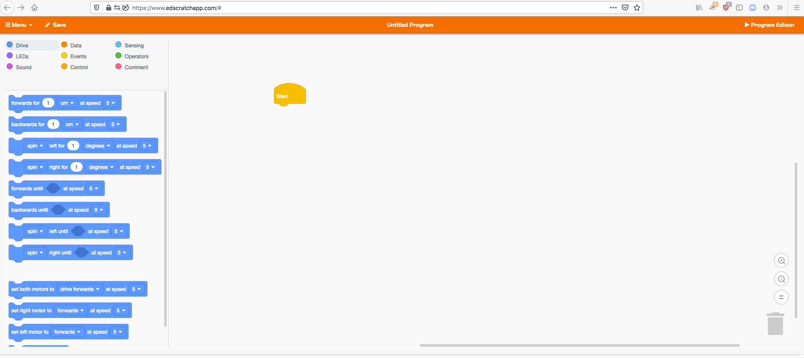
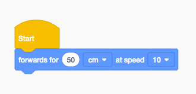
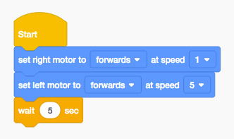
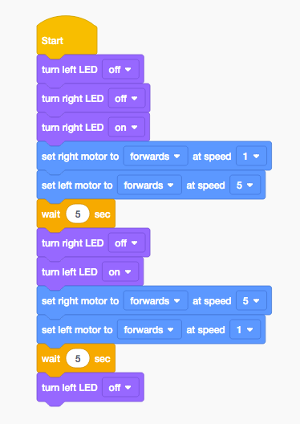
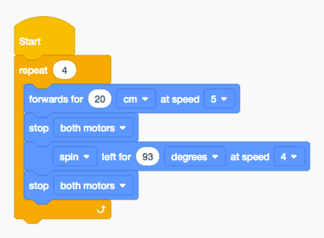
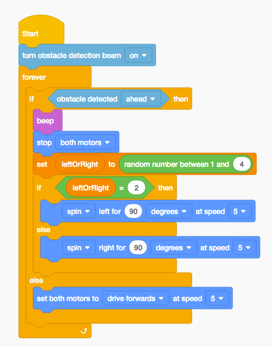
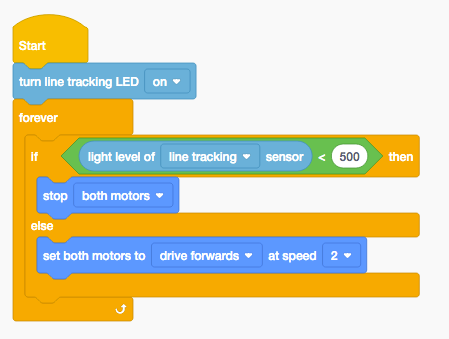
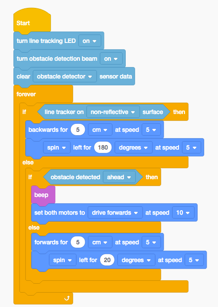

# **Edison Robot Coding Instructions**

[TOC]

## 1. Setup
1. Download the appropriate Lego Mindstorm software from this website and install it:  https://www.lego.com/en-au/themes/mindstorms/downloadsor 
2. Click on Menu, New
3. Below are all the instructions, the code can however be downloaded from this website: https://github.com/JnrEng/ev3-webinar/blob/master/Ev3MindstormsJnr.ev3

## 2. Drive Straight

   

## 3. Drive Circle

   

## 4. Drive Figure 8

   

## 5. Drive Square

   

## 6. Drive until obstacle is detected by Infra Red

   

## 7. Drive until line is detected

   

## 8. Sumo Bot

   

